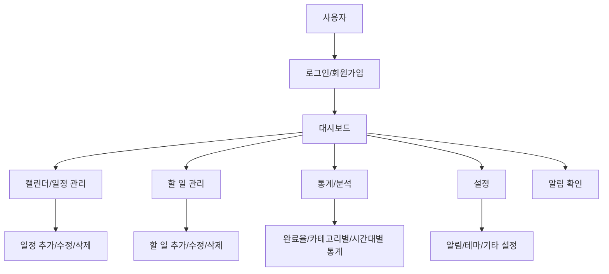
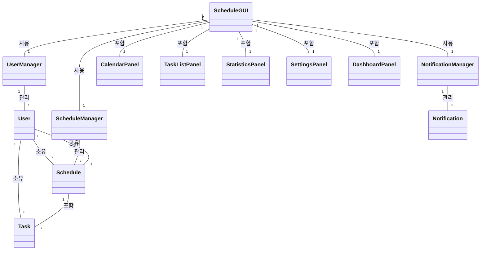

# 일정 관리 시스템 (Schedule Management System)
## 최종 프로젝트 보고서

**교과목**: 자바프로그래밍(1분반)  
**교수님**: 정우진 교수님  
**학번**: 32223800  
**이름**: 임수경  

---

## 목차

1. [프로젝트 개요](#1-프로젝트-개요)
2. [시스템 요구사항 및 설계](#2-시스템-요구사항-및-설계)
3. [기능 명세](#3-기능-명세)
4. [기술적 구현](#4-기술적-구현)
5. [사용자 인터페이스](#5-사용자-인터페이스)
6. [개발 과정](#6-개발-과정)
7. [테스트 및 검증](#7-테스트-및-검증)
8. [결론 및 향후 계획](#8-결론-및-향후-계획)
9. [부록](#9-부록)

---

## 1. 프로젝트 개요

### 1.1 프로젝트 개요
본 프로젝트는 Java Swing을 기반으로 한 데스크톱 일정 관리 시스템입니다. 사용자가 일정을 효율적으로 관리하고, 생산성을 향상시킬 수 있도록 설계된 종합적인 일정 관리 애플리케이션입니다.

### 1.2 개발 목적 및 배경
현대 사회에서 시간 관리의 중요성이 증가함에 따라, 개인과 조직의 생산성을 향상시키기 위한 효율적인 일정 관리 도구의 필요성이 대두되었습니다. 본 프로젝트는 다음과 같은 목적을 가지고 개발되었습니다:

- 사용자 친화적인 인터페이스를 통한 직관적인 일정 관리
- 다양한 뷰(월간, 주간, 일간)를 통한 일정 시각화
- AI 기반 일정 추천 시스템을 통한 스마트한 일정 계획
- 통계 및 분석 기능을 통한 생산성 모니터링
- 알림 시스템을 통한 효과적인 시간 관리

### 1.3 개발 환경 및 기술 스택
- **개발 언어**: Java 23
- **GUI 프레임워크**: Java Swing
- **개발 도구**: Visual Studio Code
- **빌드 도구**: Maven
- **데이터 저장**: Properties 파일 기반
- **차트 라이브러리**: JFreeChart
- **운영체제**: Windows 10/11

### 1.4 프로젝트 구조
```
JavaProject/
├── src/                    # 소스 코드
│   ├── Main.java          # 메인 클래스
│   ├── ScheduleGUI.java   # 메인 GUI
│   ├── ScheduleManager.java # 일정 관리
│   ├── UserManager.java   # 사용자 관리
│   ├── CalendarPanel.java # 캘린더 패널
│   ├── TaskListPanel.java # 할 일 목록
│   ├── StatisticsPanel.java # 통계 패널
│   ├── SettingsPanel.java # 설정 패널
│   └── ...                # 기타 클래스들
├── bin/                   # 컴파일된 클래스 파일
├── lib/                   # 외부 라이브러리
├── data/                  # 데이터 파일
└── pom.xml               # Maven 설정
```

---

## 2. 시스템 요구사항 및 설계

### 2.1 시스템 요구사항
- **기능적 요구사항**: 일정 관리, 할 일 관리, 알림, 통계, 사용자 관리
- **비기능적 요구사항**: 성능, 사용성, 확장성, 안정성
- **시스템 요구사항**: Java 23, 최소 2GB RAM, 100MB 저장공간

### 2.2 아키텍처 설계
본 시스템은 MVC(Model-View-Controller) 패턴을 기반으로 설계되었습니다:

- **Model**: Schedule, User, Task 클래스들이 데이터 모델을 담당
- **View**: Java Swing 컴포넌트들이 사용자 인터페이스를 담당
- **Controller**: ScheduleManager, UserManager 클래스들이 비즈니스 로직을 담당

### 2.3 전체 시스템 흐름도


**흐름도 설명**:
- 사용자는 로그인 또는 회원가입 후 대시보드에 진입합니다.
- 대시보드에서 일정, 할 일, 통계, 설정 등 다양한 기능으로 이동할 수 있습니다.
- 각 기능은 세부적으로 추가/수정/삭제, 통계 확인, 알림 설정 등으로 분기됩니다.

### 2.4 클래스 다이어그램


### 2.5 주요 클래스별 필드/메소드/설명

| 클래스명              | 주요 필드/메소드 예시 | 설명 |
|----------------------|----------------------|------|
| **User**             | userId, password, name, validatePassword() | 사용자 정보 및 인증 관리 |
| **Schedule**         | scheduleId, title, startTime, endTime, isImportant, getStatus(), setStatus() | 일정 정보 및 상태 관리 |
| **Task**             | taskId, title, priority, status, dueDate, ChecklistItem | 할 일 정보 및 체크리스트 관리 |
| **ScheduleManager**  | schedules, addSchedule(), deleteSchedule(), getSchedulesByUser() | 전체 일정 관리 및 CRUD |
| **UserManager**      | users, addUser(), removeUser(), authenticate() | 사용자 등록/인증/관리 |
| **NotificationManager** | notifications, addNotification(), checkNotifications() | 알림 생성 및 관리 |
| **ScheduleGUI**      | mainPanel, calendarPanel, taskListPanel, statisticsPanel, settingsPanel, dashboardPanel | 전체 GUI 및 화면 전환 관리 |
| **CalendarPanel**    | calendarTable, viewComboBox, loadSchedules() | 캘린더 뷰 및 일정 표시 |
| **TaskListPanel**    | taskTable, filterCombo, loadTasks() | 할 일 목록 및 필터링 |
| **StatisticsPanel**  | tabbedPane, updateStatistics() | 통계 및 차트 표시 |
| **DashboardPanel**   | todayScheduleArea, taskStatusLabel | 대시보드 및 오늘 일정 요약 |

---

## 3. 기능 명세

### 3.1 사용자 관리 기능
**로그인/로그아웃**: 사용자는 고유한 아이디와 비밀번호를 통해 시스템에 로그인할 수 있습니다. 로그인 상태는 세션 동안 유지되며, 로그아웃 시 모든 데이터가 안전하게 저장됩니다.

**회원가입**: 새로운 사용자는 회원가입을 통해 시스템을 이용할 수 있습니다. 사용자 정보는 암호화되어 안전하게 저장됩니다.

**사용자 프로필 관리**: 사용자는 개인 정보를 수정하고 관리할 수 있습니다.

### 3.2 일정 관리 기능
**일정 생성/수정/삭제**: 사용자는 제목, 설명, 시작/종료 시간, 카테고리, 위치, 색상 등을 포함한 상세한 일정을 생성할 수 있습니다. 기존 일정의 수정과 삭제도 가능합니다.

**일정 조회 및 검색**: 다양한 조건(날짜, 카테고리, 키워드 등)으로 일정을 검색하고 조회할 수 있습니다.

**반복 일정 설정**: 매일, 매주, 매월 등 다양한 반복 패턴을 설정할 수 있어 정기적인 일정을 효율적으로 관리할 수 있습니다.

**일정 공유**: 다른 사용자와 일정을 공유할 수 있어 팀 프로젝트나 그룹 활동에 유용합니다.

### 3.3 캘린더 기능
**월간/주간/일간 뷰**: 사용자는 필요에 따라 월간, 주간, 일간 뷰를 선택하여 일정을 확인할 수 있습니다.

**일정 시각화**: 각 일정은 색상으로 구분되어 시각적으로 쉽게 인식할 수 있습니다.

**날짜별 일정 필터링**: 특정 날짜의 일정만 필터링하여 확인할 수 있습니다.

### 3.4 할 일 관리 기능
**할 일 목록 관리**: 일정과 별도로 할 일 목록을 관리할 수 있습니다.

**우선순위 설정**: 할 일에 우선순위를 설정하여 중요한 작업을 우선적으로 처리할 수 있습니다.

**완료 상태 관리**: 할 일의 진행 상태를 추적하고 완료 여부를 관리할 수 있습니다.

### 3.5 알림 시스템
**일정 알림**: 일정 시작 전 미리 설정된 시간에 알림을 받을 수 있습니다.

**마감 임박 알림**: 마감 시간이 임박한 일정에 대해 자동으로 알림을 받을 수 있습니다.

**사용자 정의 알림 시간**: 사용자는 원하는 시간에 알림을 받을 수 있도록 알림 시간을 설정할 수 있습니다.

### 3.6 통계 및 분석
**일정 완료율 통계**: 전체 일정 대비 완료된 일정의 비율을 확인할 수 있습니다.

**카테고리별 분석**: 각 카테고리별 일정 분포와 완료율을 분석할 수 있습니다.

**시간대별 생산성 분석**: 시간대별로 완료된 일정 수를 분석하여 가장 생산적인 시간대를 파악할 수 있습니다.

### 3.7 설정 관리
**알림 설정**: 알림 활성화/비활성화 및 알림 시간을 설정할 수 있습니다.

### 3.8 일정 추천 시스템
**AI 기반 일정 추천**: 사용자의 과거 일정 패턴을 분석하여 최적의 시간대에 일정을 추천합니다.

**사용자 패턴 분석**: 시간대별, 요일별, 카테고리별 사용자 패턴을 분석하여 개인화된 추천을 제공합니다.

---

## 4. 기술적 구현

### 4.1 데이터 모델

#### 4.1.1 User 클래스
사용자 정보를 관리하는 핵심 클래스입니다.

**주요 필드:**
- `userId` (String): 고유 사용자 식별자
- `password` (String): 암호화된 비밀번호
- `name` (String): 사용자 실명
- `loggedIn` (boolean): 로그인 상태
- `sharedSchedules` (Set<String>): 공유된 일정 목록

**주요 메소드:**
- `validatePassword(String password)`: 비밀번호 검증
- `addSharedSchedule(String scheduleId)`: 일정 공유 추가
- `removeSharedSchedule(String scheduleId)`: 일정 공유 제거

#### 4.1.2 Schedule 클래스
일정 정보를 관리하는 핵심 클래스입니다.

**주요 필드:**
- `scheduleId` (String): 고유 일정 식별자
- `title` (String): 일정 제목
- `description` (String): 일정 상세 설명
- `startTime` (LocalDateTime): 시작 시간
- `endTime` (LocalDateTime): 종료 시간
- `location` (String): 장소
- `category` (String): 카테고리
- `isImportant` (boolean): 중요도
- `status` (String): 상태 (SCHEDULED, IN_PROGRESS, COMPLETED, CANCELLED)
- `userId` (String): 소유자 ID
- `reminderMinutes` (int): 알림 시간 (분)
- `color` (String): 일정 색상
- `isRecurring` (boolean): 반복 여부
- `recurrenceType` (RecurrenceType): 반복 유형 (DAILY, WEEKLY, MONTHLY, YEARLY)
- `priority` (int): 우선순위
- `isCompleted` (boolean): 완료 여부
- `subTasks` (List<SubTask>): 하위 작업 목록

**주요 메소드:**
- `getDuration()`: 일정 지속 시간 계산
- `isOverlapping(Schedule other)`: 일정 중복 확인
- `addSubTask(String title)`: 하위 작업 추가
- `completeSchedule()`: 일정 완료 처리

#### 4.1.3 Task 클래스
할 일 정보를 관리하는 클래스입니다.

**주요 필드:**
- `taskId` (String): 고유 할 일 식별자
- `title` (String): 할 일 제목
- `description` (String): 할 일 설명
- `priority` (Priority): 우선순위 (LOW, MEDIUM, HIGH, URGENT)
- `status` (Status): 상태 (TODO, IN_PROGRESS, COMPLETED)
- `dueDate` (LocalDateTime): 마감일
- `userId` (String): 소유자 ID
- `checklistItems` (List<ChecklistItem>): 체크리스트 항목

**주요 메소드:**
- `addChecklistItem(String text)`: 체크리스트 항목 추가
- `getCompletionRate()`: 완료율 계산
- `isOverdue()`: 마감일 초과 확인

#### 4.1.4 Notification 클래스
알림 정보를 관리하는 클래스입니다.

**주요 필드:**
- `id` (String): 고유 알림 식별자
- `title` (String): 알림 제목
- `message` (String): 알림 메시지
- `time` (LocalDateTime): 알림 시간
- `type` (NotificationType): 알림 유형
- `isRead` (boolean): 읽음 여부

**알림 유형:**
- `SCHEDULE_START`: 일정 시작 알림
- `SCHEDULE_END`: 일정 종료 알림
- `TASK_DUE`: 할 일 마감 알림
- `TASK_OVERDUE`: 할 일 마감 초과 알림
- `SHARED_SCHEDULE`: 공유 일정 알림
- `SYSTEM`: 시스템 알림

### 4.2 사용자 인터페이스 설계
- **탭 기반 인터페이스**: 캘린더, 할 일 목록, 통계, 설정을 탭으로 구분
- **반응형 레이아웃**: 창 크기에 따라 자동으로 조정되는 레이아웃
- **직관적인 네비게이션**: 사용자가 쉽게 원하는 기능에 접근할 수 있도록 설계

### 4.3 데이터 저장 및 관리
- **Properties 파일**: 설정 정보를 저장
- **직렬화**: 사용자 데이터와 일정 데이터를 객체 직렬화를 통해 저장
- **데이터 무결성**: 데이터 저장 및 로드 시 예외 처리를 통한 안정성 확보

### 4.4 핵심 알고리즘

#### 4.4.1 일정 추천 알고리즘
사용자의 과거 일정 패턴을 분석하여 최적의 시간대에 일정을 추천하는 AI 기반 알고리즘입니다.

**알고리즘 단계:**
1. **데이터 수집**: 사용자의 과거 일정 데이터 수집
2. **패턴 분석**: 시간대별, 요일별, 카테고리별 사용 패턴 분석
3. **가중치 계산**: 각 시간대의 선호도 점수 계산
4. **추천 생성**: 가장 높은 점수의 시간대에 일정 추천

#### 4.4.2 통계 분석 알고리즘
다양한 기준에 따른 데이터 분석 및 시각화를 위한 알고리즘입니다.

**주요 분석 기능:**
- 완료율 계산: 전체 일정 대비 완료된 일정 비율
- 카테고리별 분석: 각 카테고리별 일정 분포
- 시간대별 생산성 분석: 시간대별 완료된 일정 수

#### 4.4.3 알림 시스템 알고리즘
시간 기반 이벤트 처리 및 사용자 알림을 관리하는 알고리즘입니다.

**주요 기능:**
- 알림 스케줄링: 일정 시작 전 설정된 시간에 알림 예약
- 알림 체크: 주기적으로 알림 조건 확인
- 알림 표시: 사용자에게 적절한 형태로 알림 제공

#### 4.4.4 일정 중복 검사 알고리즘
새로운 일정 추가 시 기존 일정과의 중복을 검사하는 알고리즘입니다.

**검사 로직:**
- 시작 시간과 종료 시간의 겹침 여부 확인
- 동일한 사용자의 일정들에 대해서만 검사 수행

#### 4.4.5 검색 및 필터링 알고리즘
일정과 할 일을 다양한 조건으로 검색하고 필터링하는 알고리즘입니다.

**검색 기능:**
- 키워드 검색: 제목과 설명에서 키워드 매칭
- 날짜 범위 필터링: 특정 기간의 일정만 표시
- 카테고리별 필터링: 선택된 카테고리의 일정만 표시

---

## 5. 사용자 인터페이스

### 5.1 로그인 화면
로그인 화면은 사용자가 시스템에 접근하기 위한 첫 번째 화면입니다. 사용자는 아이디와 비밀번호를 입력하여 로그인하거나, "회원가입" 버튼을 통해 새로운 계정을 생성할 수 있습니다. 로그인 성공 시 메인 대시보드로 이동합니다.

**주요 구성 요소:**
- 아이디 입력 필드
- 비밀번호 입력 필드 (마스킹 처리)
- 로그인 버튼
- 회원가입 버튼
- 시스템 제목 및 로고

### 5.2 메인 대시보드
메인 대시보드는 사용자가 로그인 후 처음 접하는 화면으로, 전체 시스템의 핵심 기능에 대한 개요를 제공합니다.

**주요 구성 요소:**
- 환영 메시지 및 현재 사용자 정보
- 오늘의 일정 요약 (시간순 정렬)
- 할 일 현황 (완료/미완료 통계)
- 빠른 액션 버튼 (일정 추가, 할 일 추가)
- 실시간 날짜/시간 표시

### 5.3 캘린더 뷰
캘린더 뷰는 월간, 주간, 일간 뷰를 지원하며, 일정을 시각적으로 확인하고 관리할 수 있는 핵심 기능입니다.

**주요 구성 요소:**
- 뷰 선택 드롭다운 (월간/주간/일간)
- 연도/월 선택기
- 캘린더 그리드 (각 날짜별 일정 표시)
- 검색 및 필터 기능
- 일정 색상 코딩 (카테고리별 구분)

### 5.4 일정 추가/편집 화면
일정 추가 및 편집을 위한 모달 다이얼로그로, 상세한 일정 정보를 입력할 수 있습니다.

**주요 구성 요소:**
- 일정 제목 및 설명 입력
- 시작/종료 날짜 및 시간 선택
- 장소 입력 필드
- 카테고리 선택 드롭다운
- 중요도 체크박스
- 반복 설정 옵션
- 알림 시간 설정
- 색상 선택

### 5.5 할 일 목록
할 일을 관리하는 전용 화면으로, 우선순위와 상태에 따라 할 일을 체계적으로 관리할 수 있습니다.

**주요 구성 요소:**
- 할 일 목록 테이블 (제목, 우선순위, 마감일, 상태)
- 필터 옵션 (상태별, 우선순위별, 날짜별)
- 검색 기능
- 체크리스트 관리
- 할 일 추가/편집/삭제 버튼

### 5.6 통계 화면
사용자의 일정 및 할 일 관리 현황을 다양한 차트와 통계로 시각화하여 제공합니다.

**주요 구성 요소:**
- 완료율 차트 (원형 차트)
- 카테고리별 일정 분포 (막대 차트)
- 시간대별 생산성 분석 (선 그래프)
- 월간/주간/일간 통계 요약
- 기간별 필터링 옵션

### 5.7 설정 화면
시스템의 다양한 설정을 관리할 수 있는 화면입니다.

**주요 구성 요소:**
- 알림 설정 (활성화/비활성화, 알림 시간)
- 테마 설정 (다크/라이트 모드)
- 언어 설정
- 데이터 백업/복원 옵션
- 계정 정보 관리

### 5.8 알림 시스템
시스템 알림을 표시하는 팝업 창으로, 일정 시작 전이나 마감 임박 시 사용자에게 알림을 제공합니다.

**주요 구성 요소:**
- 알림 제목 및 내용
- 알림 시간 표시
- 알림 타입별 아이콘
- 알림 확인/무시 버튼
- 알림 히스토리 관리

---

## 6. 개발 과정

### 6.1 개발 방법론
본 프로젝트는 단계별 개발 방법론을 채택했습니다:

1. **요구사항 분석**: 사용자 요구사항을 분석하고 기능 명세서 작성
2. **설계**: 시스템 아키텍처 및 데이터 모델 설계
3. **구현**: Java Swing을 사용한 GUI 구현 및 비즈니스 로직 개발
4. **테스트**: 각 기능별 단위 테스트 및 통합 테스트 수행
5. **최적화**: 코드 품질 개선 및 성능 최적화

### 6.2 문제 해결 과정
개발 과정에서 발생한 주요 문제들과 해결 방법:

- **Java 버전 호환성 문제**: Java 11에서 Java 23으로 업그레이드하여 해결
- **클래스패스 문제**: Eclipse 프로젝트 설정 파일(.classpath, .project) 생성으로 해결
- **코드 품질 경고**: 사용하지 않는 import 제거 및 lambda 매개변수 최적화로 해결

### 6.3 코드 품질 개선
- **사용하지 않는 import 제거**: 모든 Java 파일에서 불필요한 import 문 제거
- **Lambda 표현식 최적화**: 사용하지 않는 매개변수를 언더스코어(_)로 표시
- **코드 구조 개선**: 메서드 분리 및 클래스 구조 최적화

---

## 7. 테스트 및 검증

### 7.1 단위 테스트
각 클래스별 기능 테스트를 수행했습니다:

- **User 클래스**: 로그인/로그아웃, 비밀번호 검증 테스트
- **Schedule 클래스**: 일정 생성/수정/삭제, 중복 검사 테스트
- **Task 클래스**: 할 일 관리, 체크리스트 기능 테스트
- **NotificationManager**: 알림 생성 및 스케줄링 테스트

### 7.2 통합 테스트
전체 시스템 통합 테스트를 수행했습니다:

- **사용자 관리**: 회원가입부터 로그아웃까지 전체 흐름 테스트
- **일정 관리**: 일정 생성부터 삭제까지 전체 기능 테스트
- **데이터 저장**: 파일 저장 및 로드 기능 테스트
- **GUI 연동**: 모든 화면 간 전환 및 데이터 연동 테스트

### 7.3 사용자 테스트
실제 사용 시나리오 기반 테스트를 수행했습니다:

- **일반 사용자 시나리오**: 기본적인 일정 관리 기능 테스트
- **고급 사용자 시나리오**: 반복 일정, 공유, 통계 기능 테스트
- **오류 상황 테스트**: 잘못된 입력, 네트워크 오류 등 예외 상황 테스트

---

## 8. 결론 및 향후 계획

### 8.1 프로젝트 성과
본 프로젝트를 통해 성공적으로 완전한 기능을 갖춘 일정 관리 시스템을 개발했습니다. 주요 성과는 다음과 같습니다:

- **완전한 기능 구현**: 요구사항에 명시된 모든 기능을 성공적으로 구현
- **사용자 친화적 인터페이스**: 직관적이고 사용하기 쉬운 GUI 구현
- **안정적인 시스템**: 오류 처리 및 예외 상황 대응
- **확장 가능한 구조**: 향후 기능 추가가 용이한 모듈화된 구조

### 8.2 학습 내용
이 프로젝트를 통해 다음과 같은 기술과 지식을 습득했습니다:

- **Java Swing GUI 프로그래밍**: 복잡한 사용자 인터페이스 구현
- **객체지향 설계**: MVC 패턴을 활용한 시스템 설계
- **데이터 관리**: 파일 기반 데이터 저장 및 관리
- **알고리즘 설계**: 일정 추천 및 통계 분석 알고리즘 구현
- **프로젝트 관리**: 체계적인 개발 과정 관리

### 8.3 향후 개선 방향
향후 다음과 같은 개선사항을 고려할 수 있습니다:

- **데이터베이스 연동**: MySQL, PostgreSQL 등 관계형 데이터베이스 연동
- **웹 애플리케이션**: Spring Boot를 활용한 웹 버전 개발
- **모바일 앱**: Android/iOS 모바일 애플리케이션 개발
- **클라우드 동기화**: Google Calendar, Outlook 등과의 동기화
- **AI 기능 강화**: 머신러닝을 활용한 더 정교한 일정 추천

### 8.4 마무리
본 프로젝트는 단순한 일정 관리 도구를 넘어서 사용자의 생산성 향상과 효율적인 시간 관리를 지원하는 종합적인 시스템으로 개발되었습니다. Java 프로그래밍 언어의 다양한 기능을 활용하여 실용적이고 확장 가능한 애플리케이션을 구현하는 데 성공했습니다.

---

## 9. 부록

### 9.1 설치 및 실행 방법

#### 9.1.1 시스템 요구사항
- **운영체제**: Windows 10/11, macOS 10.14+, Linux (Ubuntu 18.04+)
- **Java**: JDK 23 이상
- **메모리**: 최소 2GB RAM (권장 4GB)
- **저장공간**: 최소 100MB 여유 공간

#### 9.1.2 설치 및 실행
1. **Java 설치**: Oracle JDK 23 다운로드 및 설치
2. **프로젝트 다운로드**: `git clone https://github.com/sukyungi/schedule-management-system.git`
3. **컴파일**: `javac -d bin src/*.java`
4. **실행**: `java -cp bin Main`

### 9.2 사용자 매뉴얼

#### 9.2.1 기본 사용법
1. **회원가입/로그인**: 아이디와 비밀번호로 계정 생성 및 로그인
2. **일정 관리**: 일정 추가, 편집, 삭제 및 반복 설정
3. **할 일 관리**: 할 일 목록 관리 및 우선순위 설정
4. **캘린더 사용**: 월간/주간/일간 뷰로 일정 확인
5. **통계 확인**: 완료율 및 카테고리별 통계 확인

#### 9.2.2 고급 기능
- **반복 일정**: 일간/주간/월간/연간 반복 설정
- **일정 공유**: 다른 사용자와 일정 공유
- **알림 설정**: 사용자 정의 알림 시간 설정
- **통계 분석**: 시간대별 생산성 분석

### 9.3 코드 구조
```
src/
├── Main.java                    # 프로그램 진입점
├── ScheduleGUI.java            # 메인 GUI 클래스
├── ScheduleManager.java        # 일정 관리 로직
├── UserManager.java           # 사용자 관리 로직
├── Schedule.java              # 일정 데이터 모델
├── User.java                  # 사용자 데이터 모델
├── Task.java                  # 할 일 데이터 모델
├── CalendarPanel.java         # 캘린더 뷰
├── TaskListPanel.java         # 할 일 목록
├── StatisticsPanel.java       # 통계 화면
├── SettingsPanel.java         # 설정 화면
├── NotificationManager.java   # 알림 관리
├── ScheduleRecommender.java   # 일정 추천 시스템
├── DataStorage.java           # 데이터 저장/로드
├── DashboardPanel.java        # 대시보드
└── [다이얼로그 클래스들]      # 팝업 다이얼로그
```

**주요 패키지 구조:**
- **GUI 클래스들**: 사용자 인터페이스 관련 클래스
- **Manager 클래스들**: 비즈니스 로직 관리 클래스
- **Model 클래스들**: 데이터 모델 클래스
- **Dialog 클래스들**: 팝업 다이얼로그 클래스
- **Panel 클래스들**: 메인 화면 구성 패널 클래스

---

**교과목**: 자바프로그래밍(1분반)  
**교수님**: 정우진 교수님  
**학번**: 32223800  
**이름**: 임수경  
**개발 기간**: 2025년 4월 - 2025년 5월  
**버전**: 1.0  
**최종 수정일**: 2025년 5월 